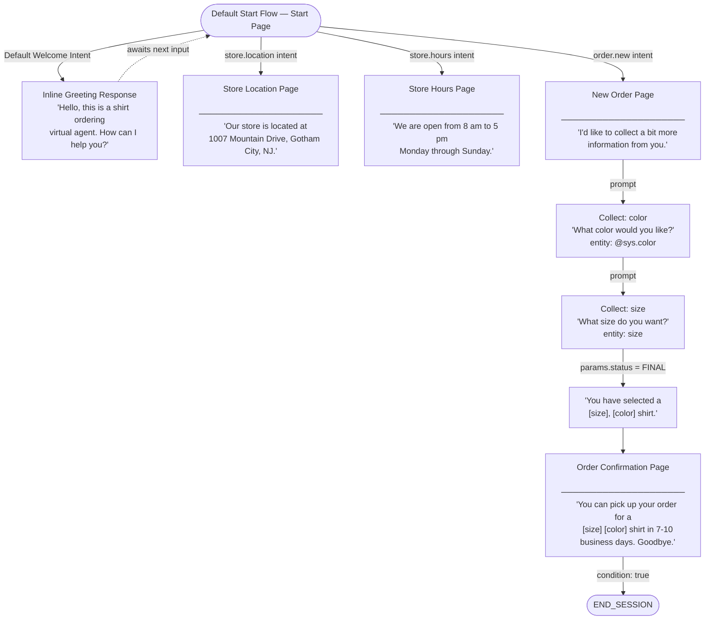

# Dialogflow CX — Shirt Ordering Agent (Terraform)

### Content
- ##### [Introduction](#intro)
- ##### [Prerequisites](#prereqs)
- ##### [Dialogflow CX Setup](#setup)
- ##### [Exploring the Created Agent](#agent)
- ##### [Agent Components](#components)
- ##### [Managing Flows & Pages](#flows)
- ##### [Conversation Design](#conversation)
- ##### [Deploying with Terraform](#terraform)
- ##### [Verifying the Deployment](#verify)
- ##### [Conclusion](#conclusion)

---

## <a name="intro"></a>Introduction

This modular Terraform configuration provisions and deploys a Dialogflow CX conversational agent on Google Cloud. The agent is a simple T-shirt store ordering virtual assistant. When interacting with this agent, users can:

- Ask where the store is located
- Ask what the store's opening hours are
- Place a shirt order by providing a colour and size through a guided conversational form
- Receive an order confirmation with a pickup timeline

The agent is built using six independent Terraform modules wired together through a root `main.tf`. This structure separates each Dialogflow resource type into its own module, making the configuration easy to read, test, and extend.

```
bucket → agent → entity_types → intents + pages → flows
```

The completed agent conversation flow looks like this:

```
User: "Hello"
Agent: "Hello, this is a shirt ordering virtual agent. How can I help you?"

User: "I want to order a shirt"
Agent: "I'd like to collect a bit more information from you. What color would you like?"

User: "Blue"
Agent: "What size do you want?"

User: "Large"
Agent: "You have selected a large, blue shirt."
Agent: "You can pick up your order for a large blue shirt in 7 to 10 business days. Goodbye."
```

---

## <a name="prereqs"></a>Prerequisites

Before deploying, ensure you have the following:

1. A [Google Cloud account](https://cloud.google.com/docs/get-started) with an active project
2. The [Dialogflow CX API enabled](https://cloud.google.com/dialogflow/cx/docs/quick/setup) in your project
3. The [gcloud CLI](https://cloud.google.com/sdk/docs/install) installed and authenticated:
   ```bash
   gcloud auth login
   gcloud auth application-default login
   ```
4. [Terraform](https://developer.hashicorp.com/terraform/downloads) installed (>= 1.0)
5. A service account JSON key file (`terraform-sa.json`) with the following roles:
   - `roles/dialogflow.admin`
   - `roles/storage.admin`
6. A GCS bucket for Terraform remote state (configured in `provider.tf`)

---

## <a name="setup"></a>Dialogflow CX Setup

The Dialogflow CX API must be enabled in your GCP project before running Terraform.

1. Go to [Google Cloud Console](https://console.cloud.google.com/) and select your project.
2. Navigate to **APIs & Services > Library** and search for `Dialogflow API`.
3. Click **Enable**.
4. (Optional) Visit the [Dialogflow CX Console](https://dialogflow.cloud.google.com/cx/projects) to verify your project is listed.

All agent resources — the agent itself, entity types, intents, pages, and flow routes — are created entirely by Terraform. You do not need to manually create anything in the console.

---

## <a name="agent"></a>Exploring the Created Agent

Once deployed, the agent can be tested directly in the Dialogflow CX console:

1. Open the [Dialogflow CX Console](https://dialogflow.cloud.google.com/cx/projects).
2. Select your project and click on **store-order-agent**.
3. Click **Test Agent** to open the simulator.
4. Type `hello` and press Enter — the agent responds with a welcome message.
5. Try the following test inputs to exercise each route:
   - `"Where is your store?"` → store address response
   - `"What are your store hours?"` → opening hours response
   - `"I want to order a shirt"` → begins the order form (prompts for colour, then size)

To edit the welcome response:
1. Click the **Build** tab.
2. Select **Default Start Flow** in the Flows panel.
3. Click the **Start** node in the graph.
4. Find the **Default Welcome Intent** route and click it.
5. Edit the fulfillment text and click **Save**.

> Note: If the agent is managed by Terraform, changes made in the console may be overwritten on the next `terraform apply`. Use `terraform.tfvars` to update configuration values instead.

---

## <a name="components"></a>Agent Components

The agent is composed of the following Terraform-managed resources:

### Agent (`modules/agent`)

The core Dialogflow CX agent resource. Configured with:

| Setting | Value |
|---|---|
| Display name | `store-order-agent` |
| Default language | `en` (English) |
| Supported languages | `fr`, `de`, `es` |
| Time zone | `America/Chicago` |
| Spell correction | Enabled |
| Speech adaptation | Enabled |
| Endpointer sensitivity | `30` |
| No-speech timeout | `3.5s` |
| DTMF input | Enabled (finish digit: `#`) |
| Audio export | GCS bucket (`gs://scales-dev-dialogflowcx-bucket/prefix-`) |
| Stackdriver logging | Enabled |
| Interaction logging | Enabled |
| PII redaction | Enabled |
| TTS voice (English) | `en-US-Neural2-A` |
| TTS voice (French) | `fr-CA-Neural2-A` |

### Entity Types (`modules/entity_types`)

Custom entity types extend the agent's ability to recognise domain-specific values.

**`size`** — a `KIND_MAP` entity that maps user phrases to canonical shirt sizes:

| Canonical Value | Recognised Synonyms |
|---|---|
| `small` | little, small, tiny |
| `medium` | medium, regular, average |
| `large` | big, giant, large |

### Intents (`modules/intents`)

Intents define what the user wants. Three custom intents are configured:

**`store.location`** — triggered when the user asks where the store is:
- "Where are you located?"
- "What is your address?"
- "How do I get to your store?"
- "Directions"
- *(7 additional training phrases)*

**`store.hours`** — triggered when the user asks about opening times:
- "What time do you close?"
- "What are your store hours?"

**`order.new`** — triggered when the user wants to place an order. Extracts two parameters:
- `color` — mapped to the built-in `@sys.color` entity
- `size` — mapped to the custom `size` entity

Training phrases include:
- "I want to order a shirt"
- "I want to buy a shirt"
- "Order a shirt"
- "I want a large, red shirt" *(annotated with size + color)*
- *(6 additional training phrases)*

### Pages (`modules/pages`)

Pages are the conversation states the agent moves through. Four pages are configured:

**Store Location page**
- Entry response: _"Our store is located at 1007 Mountain Drive, Gotham City, NJ."_

**Store Hours page**
- Entry response: _"We are open from 8 am to 5 pm Monday through Sunday."_

**New Order page**
- Collects two required form parameters before advancing:
  1. `color` (prompt: _"What color would you like?"_)
  2. `size` (prompt: _"What size do you want?"_)
- When both parameters are filled (`$page.params.status = "FINAL"`), responds with: _"You have selected a $session.params.size, $session.params.color shirt."_ and transitions to the Order Confirmation page.

**Order Confirmation page**
- Entry response: _"You can pick up your order for a $session.params.size $session.params.color shirt in 7 to 10 business days. Goodbye."_
- Transitions to `END_SESSION`.

### Flows (`modules/flows`)

A [**flow**](https://cloud.google.com/dialogflow/cx/docs/concept/flow) defines a conversation topic and its associated paths through pages and routes. Every agent includes a **Default Start Flow** that serves as the primary entry point — all conversations begin here. Simple agents may use only this flow; complex agents distribute distinct topics across multiple flows, enabling team collaboration and separation of concerns.

Each flow has a special **Start page** that becomes active when the flow is entered. Unlike regular pages, the Start page carries no form parameters or entry response — messages are delivered instead through intent routes or conditional routes attached to it.

This agent uses only the Default Start Flow. Because Dialogflow CX creates it automatically, it cannot be managed directly through the Terraform provider. The `flows` module patches it at deploy time via the REST API (see [Managing Flows & Pages](#flows)).

### Event Handlers

[**Event handlers**](https://cloud.google.com/dialogflow/cx/docs/concept/handler#symbolic) are state handlers that fire when a specific **event** occurs, rather than when user input matches an intent. They complement intent routes by covering conditions that have no direct user utterance — such as silence, unrecognised input, or webhook failures.

Event handlers can be attached at three levels:

| Level | Active while... |
|---|---|
| Flow-level | Any page within the flow is active |
| Page-level | That specific page is current |
| Parameter-level | A form parameter is being collected (reprompt handlers) |

**Built-in system events:**

| Event | Triggered when... |
|---|---|
| `sys.no-match-default` / `sys.no-match-[1-6]` | User input does not match any intent |
| `sys.no-input-default` / `sys.no-input-[1-6]` | No user input is received (e.g. silence on a voice channel) |
| `sys.invalid-parameter` | A webhook response invalidates a collected form parameter |
| `sys.long-utterance` | User input exceeds 256 characters |
| `webhook.error.*` | A webhook call fails (timeout, bad request, or service unavailable) |

Custom events can also be defined by name to handle application-specific signals — for example, a UI button click or an inventory availability change.

**Symbolic transition targets** used in event handler routes:

| Symbol | Meaning |
|---|---|
| `END_SESSION` | End the conversation session |
| `END_FLOW` | Exit the current flow normally |
| `END_FLOW_WITH_CANCELLATION` | Exit the flow indicating user cancellation |
| `END_FLOW_WITH_FAILURE` | Exit the flow indicating a failure |
| `END_FLOW_WITH_HUMAN_ESCALATION` | Hand off to a live human agent |
| `PREVIOUS_PAGE` | Return to the previous page |
| `CURRENT_PAGE` | Stay on the current page (e.g. to re-prompt) |
| `START_PAGE` | Transition to the flow's Start page |

In this agent, the **New Order page** is where event handlers are most relevant: a `sys.no-match` handler can re-prompt the user when an unrecognised colour or size is given, and a `sys.no-input` handler can prompt the user to respond if they go silent during form collection. A flow-level `sys.no-match` handler on the Default Start Flow would catch utterances that don't match any of the four configured intent routes.

### Storage Bucket (`modules/bucket`)

A Google Cloud Storage bucket (`scales-dev-dialogflowcx-bucket`) used by the agent to export audio recordings of conversations. Uniform bucket-level access is enabled.

---

## <a name="flows"></a>Managing Flows & Pages

The **Default Start Flow** is the entry point for all conversations. It is automatically created by Dialogflow CX for every agent and cannot be managed as a standard Terraform resource. The `flows` module patches it via the Dialogflow CX REST API using a `null_resource` with a `local-exec` provisioner.

The following transition routes are written to the Default Start Flow at deploy time:

| Route | Trigger | Destination |
|---|---|---|
| 1 | Default Welcome Intent | Inline greeting response |
| 2 | `store.location` intent | Store Location page |
| 3 | `store.hours` intent | Store Hours page |
| 4 | `order.new` intent | New Order page |

The REST API call uses `gcloud auth print-access-token` to obtain a short-lived OAuth2 token at apply time — no credentials are stored in Terraform state.

Flow-level **event handlers** are also declared in this same REST API payload alongside the transition routes. For example, a `sys.no-match-default` handler can be included in the `eventHandlers` array of the flow patch body to catch any utterance that doesn't match the four configured intent routes — sending a fallback response before returning to the Start page.

### Conversation flow diagram



---

## <a name="conversation"></a>Conversation Design

### Parameters and session state

The `order.new` intent extracts `color` and `size` from the user's utterance using entity annotations. These are stored as session parameters (`$session.params.color`, `$session.params.size`) and referenced in the confirmation messages on the New Order and Order Confirmation pages.

If the user starts an order without providing colour or size upfront, the New Order page form prompts for each missing value individually before advancing.

### Adding new intents and pages

To add a new capability (e.g. a returns enquiry):

1. Add a new `google_dialogflow_cx_intent` resource in `modules/intents/main.tf` with training phrases.
2. Add a new `google_dialogflow_cx_page` resource in `modules/pages/main.tf` with the appropriate entry response.
3. Export the new intent and page IDs from their respective `outputs.tf` files.
4. Wire the new IDs into the `flows` module in `main.tf`.
5. Add a new transition route to the `flows` module REST API body.
6. Run `terraform apply` and then `terraform taint module.flows.null_resource.default_start_flow && terraform apply` to re-patch the flow.

### Handling no-match and no-input with event handlers

Event handlers make conversations more robust by covering inputs the intent model cannot handle. To add them to the Default Start Flow, include an `eventHandlers` array in the REST API patch body inside the `flows` module:

```json
"eventHandlers": [
  {
    "event": "sys.no-match-default",
    "triggerFulfillment": {
      "messages": [
        { "text": { "text": ["Sorry, I didn't understand that. You can ask about store location, hours, or place an order."] } }
      ]
    },
    "targetPage": "START_PAGE"
  },
  {
    "event": "sys.no-input-default",
    "triggerFulfillment": {
      "messages": [
        { "text": { "text": ["Are you still there? How can I help you today?"] } }
      ]
    },
    "targetPage": "CURRENT_PAGE"
  }
]
```

Page-level event handlers (e.g. on the **New Order page** to re-prompt for colour or size) are included in the `eventHandlers` array of the relevant `google_dialogflow_cx_page` resource in `modules/pages/main.tf`. Parameter-level reprompt handlers are nested within the form parameter definition itself.

### Adding new entity types

To add a new entity (e.g. shirt style):

1. Add a new `google_dialogflow_cx_entity_type` resource in `modules/entity_types/main.tf`.
2. Export its ID from `outputs.tf` and pass it to the intents or pages module as needed.

---

## <a name="terraform"></a>Deploying with Terraform

### Configuration

Update `terraform.tfvars` with your environment values before deploying:

```hcl
project_id     = "your-gcp-project-id"
project_number = "your-gcp-project-number"
project_region = "us-central1"
```

Place your service account key file at `terraform/terraform-sa.json`.

### Deploy

```bash
cd terraform/
terraform init
terraform plan
terraform apply
```

### Re-patch the flow routes

The `flows` module only re-runs when its `null_resource` is tainted. If you update intents or pages and need to refresh the flow routes:

```bash
terraform taint module.flows.null_resource.default_start_flow
terraform apply
```

### Destroy

```bash
terraform destroy
```

The destroy-time provisioner in the `flows` module removes the custom transition routes before tearing down the agent, leaving Dialogflow in a clean state.

### Remote state

Terraform state is stored remotely in GCS:

```
bucket: scales-state-dev
prefix: terraform/state/dialogflow-cx
```

This is configured in `provider.tf`. Update the bucket name to match your environment.

---

## <a name="verify"></a>Verifying the Deployment

After applying, verify the agent is live using the Dialogflow CX REST API. The commands below use `gcloud` to obtain a token and `curl` to query the API.

### List agents

```bash
TOKEN=$(gcloud auth print-access-token --project=YOUR_PROJECT_ID)

curl -s \
  -H "Authorization: Bearer $TOKEN" \
  -H "x-goog-user-project: YOUR_PROJECT_ID" \
  "https://us-central1-dialogflow.googleapis.com/v3/projects/YOUR_PROJECT_ID/locations/us-central1/agents"
```

### Test a conversation turn

Replace `AGENT_ID` with the UUID from the listing above.

```bash
AGENT="projects/YOUR_PROJECT_ID/locations/us-central1/agents/AGENT_ID"
SESSION="test-session-001"
TOKEN=$(gcloud auth print-access-token --project=YOUR_PROJECT_ID)

curl -s \
  -H "Authorization: Bearer $TOKEN" \
  -H "x-goog-user-project: YOUR_PROJECT_ID" \
  -H "Content-Type: application/json" \
  --data-raw '{"queryInput":{"text":{"text":"hello"},"languageCode":"en"}}' \
  "https://us-central1-dialogflow.googleapis.com/v3/$AGENT/sessions/$SESSION:detectIntent"
```

### Full order flow test

Run each command in the same shell session (reusing `$AGENT`, `$SESSION`, `$TOKEN`):

```bash
# Step 1 — trigger the order intent
curl ... --data-raw '{"queryInput":{"text":{"text":"I want to order a shirt"},"languageCode":"en"}}' ...
# Agent: "What color would you like?"

# Step 2 — provide colour
curl ... --data-raw '{"queryInput":{"text":{"text":"blue"},"languageCode":"en"}}' ...
# Agent: "What size do you want?"

# Step 3 — provide size
curl ... --data-raw '{"queryInput":{"text":{"text":"large"},"languageCode":"en"}}' ...
# Agent: "You have selected a large, blue shirt."
# Agent: "You can pick up your order for a large blue shirt in 7 to 10 business days. Goodbye."
```

---

## <a name="conclusion"></a>Conclusion

This Terraform configuration demonstrates how to:

- Provision a complete Dialogflow CX agent using infrastructure as code
- Structure a Terraform project into reusable, decoupled modules
- Define custom entity types, intents with training phrases, and multi-step conversation pages
- Manage resources that fall outside the Terraform provider's scope using REST API provisioners
- Export and wire module outputs to create explicit resource dependencies
- Verify a live conversational agent end-to-end from the command line

The modular design makes it straightforward to extend the agent with new intents, pages, and entity types without modifying the existing modules. Environment-specific values are isolated in `terraform.tfvars`, keeping the module code reusable across projects.
